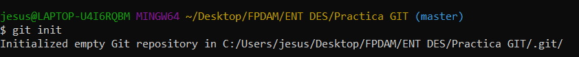
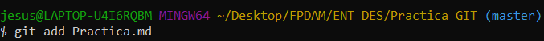
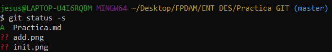
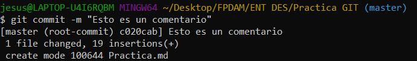
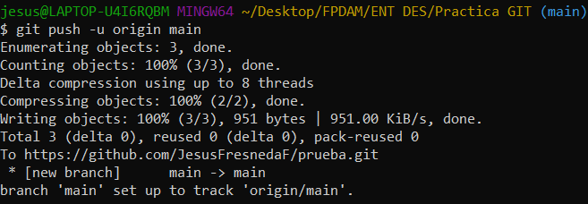

# Práctica 1 GIT
## Crear un repositorio en Github desde Git

### Paso 1: Init
En este paso, una vez tenemos el reposotorio vacío en Github, abrimos la terminal de Git en la carpeta que queremos subir al repositorio. Después, usamos el comando:

~~~
git init
~~~
Este es el resultado:

Con el comando init, pasamos a trabajar en nuestro área de ensayo (workplace), donde podremos hacer las pruebas necesarias antes de subir el repositorio.

### Paso 2: Add
A continuación, añadimos el archivo deseado al repositorio con el comando:

~~~
git add archivo.formato
~~~
Este el resultado:

Una vez hecho el comando add, pasamos al estado "index".

Si usamos el comando:

~~~
git status -s
~~~

Podremos ver el estado actual de nuestro repositorio:

### Paso 3: Commit
Una vez añadido, podemos hacer uno o varios comentarios sobre nuestro repositorio y una vez ejecutado, pasamos a la fase de "repositorio local". El comando es el siguiente:

~~~
git commit -m "Comentario"
~~~
A continuación el resultado:

### Paso 4: Remote add origin
En este paso, enlazaremos nuestro respositorio local con el repositorio vacío que tenemos en github, para más tarde, subirlo.
El comando es éste:
~~~
remote add origin "url"
~~~

### Paso 5: Branch -m main

Con este comando, creamos la rama principal donde estará nuestro respositorio, con el branch podemos crear varias ramas con distintos archivos en cada rama. 

El comando es el siguiente:
~~~
git branch -M main
~~~

### Paso 6: Push
Finalmente, con el push pasamos del repositorio local al repositorio remoto. El comando es el siguiente:

~~~
git push -u origin master
~~~

